# Azure Network Security & Traffic Analysis — Hub-and-Spoke with Azure Firewall, Packet Capture & KQL

**Status:** ✅ Complete — deployed, tested, and torn down (VNet flow logs never produced data; see Troubleshooting)

## 🎬 Video Walkthrough

> 📹 Loom walkthrough coming soon.

## 📖 Project Overview

I built a hub-and-spoke network in Azure where a central Azure Firewall inspects all traffic between two spoke VNets. User-defined routes force spoke-to-spoke traffic through the firewall instead of across the peerings directly. I tested the path between two Ubuntu VMs, captured live packets with Network Watcher, and queried the firewall's logs with KQL in Log Analytics. I also configured VNet flow logs with Traffic Analytics. They reported healthy but never produced data, and Step 9 documents how I traced that.

Along the way I made several changes to keep the build current with what Azure accepts today:

- **Firewall Policy instead of classic rules.** Azure Firewall Basic can only be managed through a Firewall Policy, so the spoke-to-spoke rule lives in a policy rule collection group attached to the firewall.
- **Management NIC for Firewall Basic.** The Basic SKU requires an `AzureFirewallManagementSubnet` (/26 minimum) and a second public IP for Microsoft's management traffic.
- **VNet flow logs instead of NSG flow logs.** New NSG flow logs can no longer be created, so I enabled VNet flow logs on each spoke VNet, with Traffic Analytics sending results to the `NTANetAnalytics` table. In this build, the flow logs never wrote any data (see Step 9 and Troubleshooting).
- **Resource-specific firewall logs.** I sent firewall logs to the structured `AZFWNetworkRule` / `AZFWApplicationRule` tables instead of the legacy `AzureDiagnostics` table, so queries use typed columns instead of parsing free-text messages.
- **Existing Network Watcher.** Azure creates one Network Watcher per region per subscription automatically, so I reference it with a data source rather than creating a second one.
- **VM access via Run Command.** The VMs have no public IPs, so I ran commands on them through `az vm run-command invoke`, which goes through the Azure control plane and needs no inbound network path. In production I'd use Azure Bastion instead, since it gives interactive SSH over private IPs and (on the paid SKUs) reaches VMs across peered spokes.

### Skills Demonstrated

- Hub-and-spoke network design with VNet peering
- Forced routing through a central firewall with user-defined routes (UDRs)
- Azure Firewall Basic with Firewall Policy and network rule collections
- VNet flow log and Traffic Analytics configuration, and tracing a telemetry pipeline that reported healthy but produced no data
- Network Watcher packet capture
- KQL queries against `AZFWNetworkRule` (and `NTANetAnalytics`, which stayed empty)
- Terraform with azurerm 4.x, including platform-owned resources via data sources
- Adapting infrastructure code to retired and changed Azure features

## 🏗️ Architecture Diagram

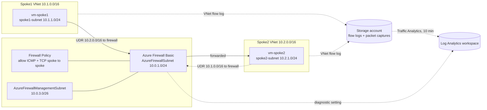

There is no direct path between the spokes. Each spoke only peers with the hub, and the UDRs send cross-spoke traffic to the firewall's private IP. The firewall's diagnostic path to Log Analytics worked. The flow log path was deployed as shown, but it never produced data.

## ✅ Prerequisites

- Azure subscription with Owner or Contributor access
- Azure CLI installed and signed in (`az login`)
- Terraform 1.3+
- VS Code with PowerShell on Windows
- Wireshark (optional, to open the packet capture file)

## 🏷️ Naming Conventions

| Resource | Name |
|---|---|
| Resource group | `rg-lab-network-gavinbarbee` |
| Log Analytics workspace | `law-lab-network-gavinbarbee` |
| Hub VNet | `vnet-hub-gavinbarbee` |
| Spoke VNets | `vnet-spoke1-gavinbarbee`, `vnet-spoke2-gavinbarbee` |
| Azure Firewall | `fw-lab-gavinbarbee` |
| Firewall Policy | `fwpol-lab-gavinbarbee` |
| Firewall public IPs | `pip-firewall-gavinbarbee`, `pip-firewall-mgmt-gavinbarbee` |
| Route tables | `rt-spoke1-gavinbarbee`, `rt-spoke2-gavinbarbee` |
| NSG | `nsg-spokes-gavinbarbee` |
| Storage account | `stflowlogsgavinbarbee` |
| VNet flow logs | `flowlog-spoke1-gavinbarbee`, `flowlog-spoke2-gavinbarbee` |
| VMs | `vm-spoke1-gavinbarbee`, `vm-spoke2-gavinbarbee` |
| Network Watcher (platform-owned) | `NetworkWatcher_centralus` in `NetworkWatcherRG` |

## 🪜 Project Steps

### Step 1: Create the project folder

The Terraform files live in a `terraform/` subfolder, with the KQL queries in `kql/` and the README at the repo root:

```text
azure-network-security-traffic-analysis/
├── README.md
├── .gitignore
├── kql/
│   ├── allowed-traffic.kql
│   ├── denied-traffic.kql
│   └── firewall-network-rule.kql
├── screenshots/
└── terraform/
    ├── main.tf
    ├── variables.tf
    ├── outputs.tf
    └── terraform.tfvars.example
```

```powershell
New-Item -ItemType Directory -Path "$env:OneDrive\Desktop\azure-network-security-traffic-analysis\terraform"
```

```powershell
Set-Location "$env:OneDrive\Desktop\azure-network-security-traffic-analysis\terraform"
```

All `terraform` commands below run from the `terraform/` folder.

### Step 2: Pre-flight check for VM size and region

VM size availability varies per subscription, so I checked it before choosing a size and region. Without `--all`, restricted sizes are hidden from the output entirely. `Standard_D2alds_v7` showed no restrictions in Central US, with 10 vCPUs of Daldsv7 quota available; the two VMs use 4.

```powershell
az vm list-skus --location centralus --size Standard_D2alds_v7 --all --output table
```

```powershell
az vm list-usage --location centralus --output table | Select-String "Total Regional vCPUs|Daldsv7"
```

I also checked which regions already had a Network Watcher, since the Terraform config references the platform-owned one rather than creating its own:

```powershell
az network watcher list --query "[].{name:name, rg:resourceGroup, location:location}" -o table
```

Central US didn't have one yet. Azure auto-creates it when the first VNet in the region is created, so the config waits 60 seconds after the VNets deploy and then reads `NetworkWatcher_centralus` with a data source.

📸 *Screenshot: pre-flight results*
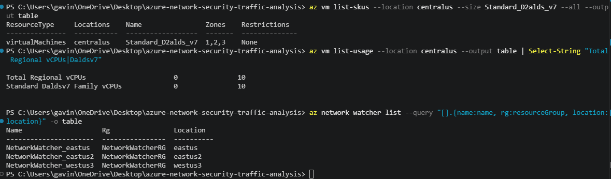

### Step 3: Write the Terraform files

**`terraform/variables.tf`**

```hcl
variable "subscription_id" {
  description = "Azure subscription ID (required by azurerm 4.x)."
  type        = string
}

variable "yourname" {
  description = "Your name — makes resource names unique."
  type        = string
}

variable "location" {
  description = "Azure region. Chosen from the VM pre-flight check."
  type        = string
}

variable "vm_size" {
  description = "VM size for both spoke VMs. Chosen from the VM pre-flight check."
  type        = string
}

variable "admin_username" {
  type    = string
  default = "labadmin"
}

variable "admin_password" {
  type      = string
  sensitive = true
}

variable "tags" {
  type    = map(string)
  default = { lab = "network-security" }
}
```

**`terraform/main.tf`**

```hcl
terraform {
  required_providers {
    azurerm = {
      source  = "hashicorp/azurerm"
      version = "~> 4.0"
    }
    time = {
      source  = "hashicorp/time"
      version = "~> 0.12"
    }
  }
}

provider "azurerm" {
  features {}
  subscription_id = var.subscription_id
}

# ── Resource Group ──────────────────────────────────────────
resource "azurerm_resource_group" "main" {
  name     = "rg-lab-network-${var.yourname}"
  location = var.location
  tags     = var.tags
}

# ── Log Analytics Workspace ──────────────────────────────────
# Receives firewall logs and Traffic Analytics output from the VNet flow logs
resource "azurerm_log_analytics_workspace" "main" {
  name                = "law-lab-network-${var.yourname}"
  location            = var.location
  resource_group_name = azurerm_resource_group.main.name
  sku                 = "PerGB2018"
  retention_in_days   = 30
  tags                = var.tags
}

# ── Hub VNet and Subnets ─────────────────────────────────────
resource "azurerm_virtual_network" "hub" {
  name                = "vnet-hub-${var.yourname}"
  location            = var.location
  resource_group_name = azurerm_resource_group.main.name
  address_space       = ["10.0.0.0/16"]
  tags                = var.tags
}

# Azure Firewall requires this exact subnet name
resource "azurerm_subnet" "firewall" {
  name                 = "AzureFirewallSubnet"
  resource_group_name  = azurerm_resource_group.main.name
  virtual_network_name = azurerm_virtual_network.hub.name
  address_prefixes     = ["10.0.1.0/24"]
}

# Firewall Basic requires a management subnet with this exact name (/26 minimum)
resource "azurerm_subnet" "firewall_mgmt" {
  name                 = "AzureFirewallManagementSubnet"
  resource_group_name  = azurerm_resource_group.main.name
  virtual_network_name = azurerm_virtual_network.hub.name
  address_prefixes     = ["10.0.3.0/26"]
}

# ── Spoke VNets ──────────────────────────────────────────────
resource "azurerm_virtual_network" "spoke1" {
  name                = "vnet-spoke1-${var.yourname}"
  location            = var.location
  resource_group_name = azurerm_resource_group.main.name
  address_space       = ["10.1.0.0/16"]
  tags                = var.tags
}

resource "azurerm_subnet" "spoke1" {
  name                 = "spoke1-subnet"
  resource_group_name  = azurerm_resource_group.main.name
  virtual_network_name = azurerm_virtual_network.spoke1.name
  address_prefixes     = ["10.1.1.0/24"]
}

resource "azurerm_virtual_network" "spoke2" {
  name                = "vnet-spoke2-${var.yourname}"
  location            = var.location
  resource_group_name = azurerm_resource_group.main.name
  address_space       = ["10.2.0.0/16"]
  tags                = var.tags
}

resource "azurerm_subnet" "spoke2" {
  name                 = "spoke2-subnet"
  resource_group_name  = azurerm_resource_group.main.name
  virtual_network_name = azurerm_virtual_network.spoke2.name
  address_prefixes     = ["10.2.1.0/24"]
}

# ── VNet Peerings ────────────────────────────────────────────
# Peering connects VNets so they can communicate.
# Both directions must be created — Azure requires explicit bidirectional peering.
resource "azurerm_virtual_network_peering" "hub_to_spoke1" {
  name                      = "hub-to-spoke1"
  resource_group_name       = azurerm_resource_group.main.name
  virtual_network_name      = azurerm_virtual_network.hub.name
  remote_virtual_network_id = azurerm_virtual_network.spoke1.id
  allow_forwarded_traffic   = true
}

resource "azurerm_virtual_network_peering" "spoke1_to_hub" {
  name                      = "spoke1-to-hub"
  resource_group_name       = azurerm_resource_group.main.name
  virtual_network_name      = azurerm_virtual_network.spoke1.name
  remote_virtual_network_id = azurerm_virtual_network.hub.id
  allow_forwarded_traffic   = true
}

resource "azurerm_virtual_network_peering" "hub_to_spoke2" {
  name                      = "hub-to-spoke2"
  resource_group_name       = azurerm_resource_group.main.name
  virtual_network_name      = azurerm_virtual_network.hub.name
  remote_virtual_network_id = azurerm_virtual_network.spoke2.id
  allow_forwarded_traffic   = true
}

resource "azurerm_virtual_network_peering" "spoke2_to_hub" {
  name                      = "spoke2-to-hub"
  resource_group_name       = azurerm_resource_group.main.name
  virtual_network_name      = azurerm_virtual_network.spoke2.name
  remote_virtual_network_id = azurerm_virtual_network.hub.id
  allow_forwarded_traffic   = true
}

# ── Azure Firewall ────────────────────────────────────────────
resource "azurerm_public_ip" "firewall" {
  name                = "pip-firewall-${var.yourname}"
  location            = var.location
  resource_group_name = azurerm_resource_group.main.name
  allocation_method   = "Static"
  sku                 = "Standard"
  tags                = var.tags
}

# Management public IP required by the Basic SKU's management NIC
resource "azurerm_public_ip" "firewall_mgmt" {
  name                = "pip-firewall-mgmt-${var.yourname}"
  location            = var.location
  resource_group_name = azurerm_resource_group.main.name
  allocation_method   = "Static"
  sku                 = "Standard"
  tags                = var.tags
}

# Basic SKU firewalls are managed through a Firewall Policy (no classic rules)
resource "azurerm_firewall_policy" "main" {
  name                = "fwpol-lab-${var.yourname}"
  location            = var.location
  resource_group_name = azurerm_resource_group.main.name
  sku                 = "Basic"
  tags                = var.tags
}

resource "azurerm_firewall" "main" {
  name                = "fw-lab-${var.yourname}"
  location            = var.location
  resource_group_name = azurerm_resource_group.main.name
  sku_name            = "AZFW_VNet"
  sku_tier            = "Basic" # Basic is the lowest cost option
  firewall_policy_id  = azurerm_firewall_policy.main.id

  ip_configuration {
    name                 = "fw-ipconfig"
    subnet_id            = azurerm_subnet.firewall.id
    public_ip_address_id = azurerm_public_ip.firewall.id
  }

  management_ip_configuration {
    name                 = "fw-mgmt-ipconfig"
    subnet_id            = azurerm_subnet.firewall_mgmt.id
    public_ip_address_id = azurerm_public_ip.firewall_mgmt.id
  }

  tags = var.tags
}

# Send firewall logs to Log Analytics in resource-specific (structured) tables
resource "azurerm_monitor_diagnostic_setting" "firewall" {
  name                           = "diag-firewall"
  target_resource_id             = azurerm_firewall.main.id
  log_analytics_workspace_id     = azurerm_log_analytics_workspace.main.id
  log_analytics_destination_type = "Dedicated"

  enabled_log {
    category = "AZFWNetworkRule"
  }

  enabled_log {
    category = "AZFWApplicationRule"
  }

  enabled_metric {
    category = "AllMetrics"
  }
}

# Allow ICMP and TCP between spokes through the firewall
resource "azurerm_firewall_policy_rule_collection_group" "spoke_to_spoke" {
  name               = "rcg-spoke-to-spoke"
  firewall_policy_id = azurerm_firewall_policy.main.id
  priority           = 100

  network_rule_collection {
    name     = "allow-spoke-to-spoke"
    priority = 100
    action   = "Allow"

    rule {
      name                  = "allow-icmp-tcp"
      protocols             = ["ICMP", "TCP"]
      source_addresses      = ["10.1.0.0/16", "10.2.0.0/16"]
      destination_addresses = ["10.1.0.0/16", "10.2.0.0/16"]
      destination_ports     = ["*"]
    }
  }
}

# ── UDRs — force spoke traffic through the firewall ──────────
# Without these, Azure routes traffic directly between peered VNets.
# The UDR overrides that default and sends traffic to the firewall IP.
resource "azurerm_route_table" "spoke1" {
  name                = "rt-spoke1-${var.yourname}"
  location            = var.location
  resource_group_name = azurerm_resource_group.main.name

  route {
    name                   = "to-spoke2-via-fw"
    address_prefix         = "10.2.0.0/16"
    next_hop_type          = "VirtualAppliance"
    next_hop_in_ip_address = azurerm_firewall.main.ip_configuration[0].private_ip_address
  }

  tags = var.tags
}

resource "azurerm_subnet_route_table_association" "spoke1" {
  subnet_id      = azurerm_subnet.spoke1.id
  route_table_id = azurerm_route_table.spoke1.id
}

resource "azurerm_route_table" "spoke2" {
  name                = "rt-spoke2-${var.yourname}"
  location            = var.location
  resource_group_name = azurerm_resource_group.main.name

  route {
    name                   = "to-spoke1-via-fw"
    address_prefix         = "10.1.0.0/16"
    next_hop_type          = "VirtualAppliance"
    next_hop_in_ip_address = azurerm_firewall.main.ip_configuration[0].private_ip_address
  }

  tags = var.tags
}

resource "azurerm_subnet_route_table_association" "spoke2" {
  subnet_id      = azurerm_subnet.spoke2.id
  route_table_id = azurerm_route_table.spoke2.id
}

# ── NSG for the spoke VM NICs ────────────────────────────────
resource "azurerm_network_security_group" "spoke" {
  name                = "nsg-spokes-${var.yourname}"
  location            = var.location
  resource_group_name = azurerm_resource_group.main.name

  security_rule {
    name                       = "allow-ssh"
    priority                   = 1000
    direction                  = "Inbound"
    access                     = "Allow"
    protocol                   = "Tcp"
    source_port_range          = "*"
    destination_port_range     = "22"
    source_address_prefix      = "*"
    destination_address_prefix = "*"
  }

  security_rule {
    name                       = "allow-icmp"
    priority                   = 1010
    direction                  = "Inbound"
    access                     = "Allow"
    protocol                   = "Icmp"
    source_port_range          = "*"
    destination_port_range     = "*"
    source_address_prefix      = "*"
    destination_address_prefix = "*"
  }

  tags = var.tags
}

# ── VNet Flow Logs + Traffic Analytics ───────────────────────
resource "azurerm_storage_account" "flowlogs" {
  name                     = "stflowlogs${var.yourname}"
  resource_group_name      = azurerm_resource_group.main.name
  location                 = var.location
  account_tier             = "Standard"
  account_replication_type = "LRS"
  tags                     = var.tags
}

# Network Watcher is platform-owned: Azure auto-creates one per region per
# subscription (NetworkWatcher_<region> in NetworkWatcherRG) when a VNet is
# created. Wait for it, then reference it instead of creating a second one.
resource "time_sleep" "wait_for_network_watcher" {
  create_duration = "60s"

  depends_on = [
    azurerm_virtual_network.hub,
    azurerm_virtual_network.spoke1,
    azurerm_virtual_network.spoke2,
  ]
}

data "azurerm_network_watcher" "main" {
  name                = "NetworkWatcher_${var.location}"
  resource_group_name = "NetworkWatcherRG"

  depends_on = [time_sleep.wait_for_network_watcher]
}

resource "azurerm_network_watcher_flow_log" "spoke1" {
  network_watcher_name = data.azurerm_network_watcher.main.name
  resource_group_name  = data.azurerm_network_watcher.main.resource_group_name
  name                 = "flowlog-spoke1-${var.yourname}"
  target_resource_id   = azurerm_virtual_network.spoke1.id
  storage_account_id   = azurerm_storage_account.flowlogs.id
  enabled              = true
  version              = 2

  retention_policy {
    enabled = true
    days    = 7
  }

  traffic_analytics {
    enabled               = true
    workspace_id          = azurerm_log_analytics_workspace.main.workspace_id
    workspace_region      = azurerm_log_analytics_workspace.main.location
    workspace_resource_id = azurerm_log_analytics_workspace.main.id
    interval_in_minutes   = 10
  }

  tags = var.tags
}

resource "azurerm_network_watcher_flow_log" "spoke2" {
  network_watcher_name = data.azurerm_network_watcher.main.name
  resource_group_name  = data.azurerm_network_watcher.main.resource_group_name
  name                 = "flowlog-spoke2-${var.yourname}"
  target_resource_id   = azurerm_virtual_network.spoke2.id
  storage_account_id   = azurerm_storage_account.flowlogs.id
  enabled              = true
  version              = 2

  retention_policy {
    enabled = true
    days    = 7
  }

  traffic_analytics {
    enabled               = true
    workspace_id          = azurerm_log_analytics_workspace.main.workspace_id
    workspace_region      = azurerm_log_analytics_workspace.main.location
    workspace_resource_id = azurerm_log_analytics_workspace.main.id
    interval_in_minutes   = 10
  }

  tags = var.tags
}

# ── Two Ubuntu VMs (size chosen from the pre-flight check) ───
resource "azurerm_network_interface" "spoke1" {
  name                = "nic-spoke1-${var.yourname}"
  location            = var.location
  resource_group_name = azurerm_resource_group.main.name

  ip_configuration {
    name                          = "internal"
    subnet_id                     = azurerm_subnet.spoke1.id
    private_ip_address_allocation = "Dynamic"
  }
}

resource "azurerm_network_interface_security_group_association" "spoke1" {
  network_interface_id      = azurerm_network_interface.spoke1.id
  network_security_group_id = azurerm_network_security_group.spoke.id
}

resource "azurerm_linux_virtual_machine" "spoke1" {
  name                            = "vm-spoke1-${var.yourname}"
  location                        = var.location
  resource_group_name             = azurerm_resource_group.main.name
  size                            = var.vm_size
  admin_username                  = var.admin_username
  admin_password                  = var.admin_password
  disable_password_authentication = false
  network_interface_ids           = [azurerm_network_interface.spoke1.id]

  os_disk {
    caching              = "ReadWrite"
    storage_account_type = "Standard_LRS"
  }

  source_image_reference {
    publisher = "Canonical"
    offer     = "0001-com-ubuntu-server-jammy"
    sku       = "22_04-lts-gen2"
    version   = "latest"
  }

  tags = var.tags
}

# Packet capture runs through the Network Watcher agent extension on the VM
resource "azurerm_virtual_machine_extension" "nw_agent_spoke1" {
  name                       = "AzureNetworkWatcherExtension"
  virtual_machine_id         = azurerm_linux_virtual_machine.spoke1.id
  publisher                  = "Microsoft.Azure.NetworkWatcher"
  type                       = "NetworkWatcherAgentLinux"
  type_handler_version       = "1.4"
  auto_upgrade_minor_version = true
  tags                       = var.tags
}

resource "azurerm_network_interface" "spoke2" {
  name                = "nic-spoke2-${var.yourname}"
  location            = var.location
  resource_group_name = azurerm_resource_group.main.name

  ip_configuration {
    name                          = "internal"
    subnet_id                     = azurerm_subnet.spoke2.id
    private_ip_address_allocation = "Dynamic"
  }
}

resource "azurerm_network_interface_security_group_association" "spoke2" {
  network_interface_id      = azurerm_network_interface.spoke2.id
  network_security_group_id = azurerm_network_security_group.spoke.id
}

resource "azurerm_linux_virtual_machine" "spoke2" {
  name                            = "vm-spoke2-${var.yourname}"
  location                        = var.location
  resource_group_name             = azurerm_resource_group.main.name
  size                            = var.vm_size
  admin_username                  = var.admin_username
  admin_password                  = var.admin_password
  disable_password_authentication = false
  network_interface_ids           = [azurerm_network_interface.spoke2.id]

  os_disk {
    caching              = "ReadWrite"
    storage_account_type = "Standard_LRS"
  }

  source_image_reference {
    publisher = "Canonical"
    offer     = "0001-com-ubuntu-server-jammy"
    sku       = "22_04-lts-gen2"
    version   = "latest"
  }

  tags = var.tags
}
```

**`terraform/outputs.tf`**

```hcl
output "spoke1_private_ip" {
  value = azurerm_network_interface.spoke1.private_ip_address
}

output "spoke2_private_ip" {
  value = azurerm_network_interface.spoke2.private_ip_address
}

output "firewall_private_ip" {
  value = azurerm_firewall.main.ip_configuration[0].private_ip_address
}
```

**`terraform/terraform.tfvars`** — copy `terraform.tfvars.example`, then fill in real values. This file is gitignored.

```powershell
Copy-Item terraform.tfvars.example terraform.tfvars
```

```hcl
subscription_id = "<your-subscription-id>"
yourname        = "gavinbarbee"
location        = "centralus"
vm_size         = "Standard_D2alds_v7"
admin_username  = "labadmin"
admin_password  = "<choose-a-strong-password>"
```

### Step 4: Deploy

```powershell
terraform init
```

```powershell
terraform plan "-out=main.tfplan"
```

```powershell
terraform apply main.tfplan
```

📸 *Screenshot: apply complete*
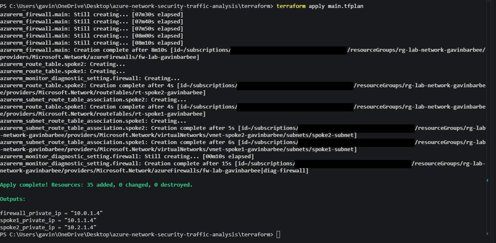

The Activity Log showed how the Network Watcher dependency played out. Azure auto-created `NetworkWatcher_centralus` in the same second the VNets were created, and Terraform created the flow logs about 76 seconds later, after the 60-second wait.

Then I confirmed the deployed state matches the configuration. It returned "No changes" on the first check:

```powershell
terraform plan
```

📸 *Screenshot: "No changes" after apply*
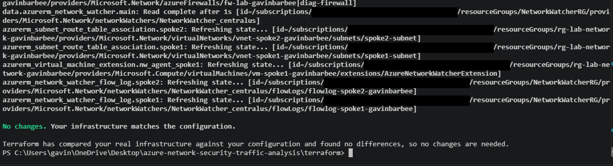

### Step 5: Check the VMs' private IPs

```powershell
terraform output
```

```powershell
az vm run-command invoke -g rg-lab-network-gavinbarbee -n vm-spoke1-gavinbarbee --command-id RunShellScript --scripts "ip addr show eth0 | grep 'inet '" --query "value[0].message" -o tsv
```

📸 *Screenshot: spoke1 private IP*
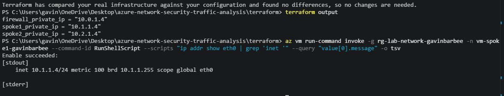

Terraform assigned `10.1.1.4` to spoke1, `10.2.1.4` to spoke2, and `10.0.1.4` to the firewall (the first usable address in `AzureFirewallSubnet`). Run Command confirmed `10.1.1.4/24` on spoke1's `eth0`.

### Step 6: Test traffic through the firewall

```powershell
$spoke2 = terraform output -raw spoke2_private_ip
```

```powershell
az vm run-command invoke -g rg-lab-network-gavinbarbee -n vm-spoke1-gavinbarbee --command-id RunShellScript --scripts "ping -c 10 $spoke2" --query "value[0].message" -o tsv
```

📸 *Screenshot: ping results (allowed)*
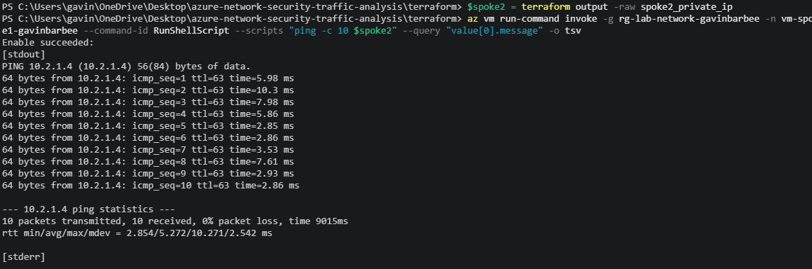

All 10 packets came back (0% loss), and every reply showed `ttl=63`. Linux sends with a TTL of 64, so one hop decremented it on the way to spoke2. That matches the traffic going through the firewall rather than directly across a peering.

### Step 7: Block traffic at the firewall

In the Portal: **Firewall Policies → `fwpol-lab-gavinbarbee` → Rule collections → `allow-spoke-to-spoke` → Edit**, change the action to **Deny**, and save. Then I ran the same ping again:

```powershell
az vm run-command invoke -g rg-lab-network-gavinbarbee -n vm-spoke1-gavinbarbee --command-id RunShellScript --scripts "ping -c 10 $spoke2" --query "value[0].message" -o tsv
```

📸 *Screenshot: rule collection set to Deny*
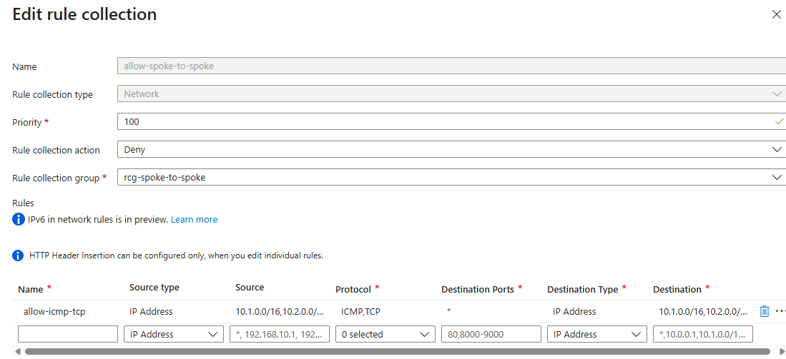

📸 *Screenshot: ping results (denied)*
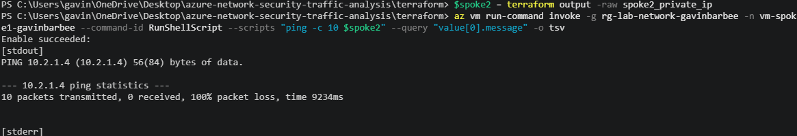

With the rule collection set to Deny, all 10 packets were dropped (`10 packets transmitted, 0 received, 100% packet loss`). Since the spokes only peer with the hub and the UDRs send cross-spoke traffic to the firewall, there's no path around it.

I then set the action back to **Allow** and confirmed Terraform showed no drift:

```powershell
terraform plan
```

📸 *Screenshot: "No changes" after reverting to Allow*
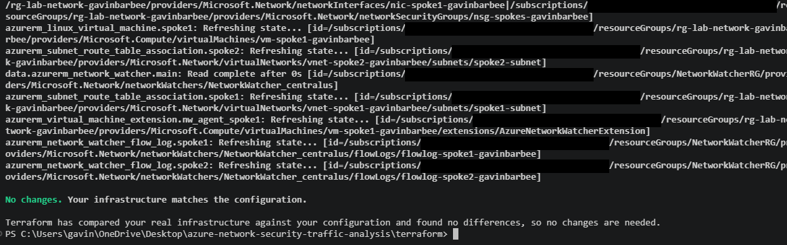

### Step 8: Packet capture with Network Watcher

```powershell
az network watcher packet-capture create --resource-group rg-lab-network-gavinbarbee --vm vm-spoke1-gavinbarbee --name capture-lab --storage-account stflowlogsgavinbarbee --time-limit 60
```

While the capture ran, I generated traffic:

```powershell
az vm run-command invoke -g rg-lab-network-gavinbarbee -n vm-spoke1-gavinbarbee --command-id RunShellScript --scripts "ping -c 30 $spoke2" --query "value[0].message" -o tsv
```

The ping returned 30 out of 30 with `ttl=63` on every reply while the capture ran.

The packet capture resource belongs to the Network Watcher rather than to the project's resource group (it was created in `NetworkWatcherRG`), so checking its status takes only the location and name:

```powershell
az network watcher packet-capture show-status --location centralus --name capture-lab
```

📸 *Screenshot: capture status*
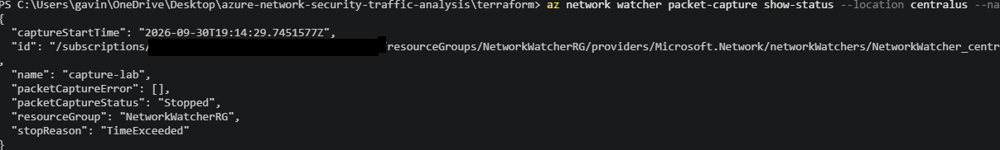

The capture reported `packetCaptureStatus: Stopped` with `stopReason: TimeExceeded` and no capture errors, meaning it ran the full 60 seconds and finished normally.

I downloaded the `.cap` file from the storage account in the Portal and opened it in Wireshark with an `icmp` display filter.

📸 *Screenshot: capture in Wireshark, echo request selected*
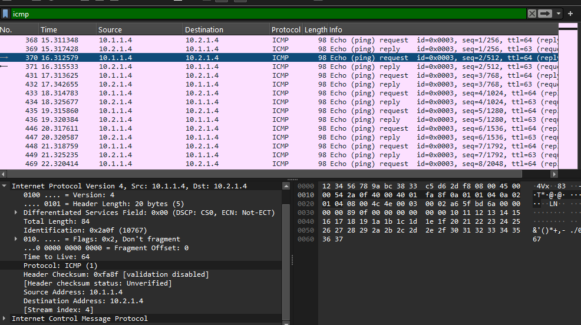

📸 *Screenshot: echo reply IP header*
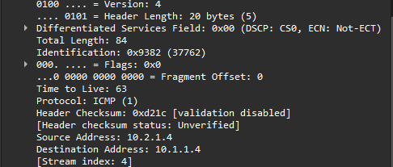

The capture shows both halves of the `ttl=63` result from the ping output. The echo requests leave spoke1 (`10.1.1.4` → `10.2.1.4`) with a TTL of 64, because the capture runs on spoke1's own NIC before the packet reaches the firewall. The echo replies arrive back (`10.2.1.4` → `10.1.1.4`) with a TTL of 63, because they crossed the firewall on the way back.

### Step 9: Query flow logs and firewall logs with KQL

In the Portal: **Log Analytics workspace → `law-lab-network-gavinbarbee` → Logs**.

**Allowed traffic, last 30 minutes** (`kql/allowed-traffic.kql`)

```kql
NTANetAnalytics
| where TimeGenerated > ago(30m)
| where SubType == 'FlowLog'
| where FlowStatus == 'A' // A = Allowed, D = Denied
| project TimeGenerated, SrcIp, DestIp, DestPort, L4Protocol
| order by TimeGenerated desc
```

This query returned no results. So did a check of the whole table with no time filter:

```kql
NTANetAnalytics
| summarize Rows = count(), Latest = max(TimeGenerated), Protocols = make_set(L4Protocol)
```

It returned 0 rows. I traced the pipeline back to its first stage. VNet flow logs write raw blobs to an `insights-logs-flowlogflowevent` container in the storage account, and Traffic Analytics reads from there. That container never appeared, so Traffic Analytics had nothing to process. Both flow logs reported `Enabled`, `Succeeded`, Traffic Analytics on at a 10-minute interval, the correct target VNet, and the correct storage account. The `Microsoft.Insights` resource provider was registered. More than an hour after the flow logs were created, the storage account still held only the packet capture container.

The flow logs were created about 76 seconds after Azure auto-created the Network Watcher, so I suspected they hadn't taken effect underneath. I recreated both through Terraform:

```powershell
terraform plan "-replace=azurerm_network_watcher_flow_log.spoke1" "-replace=azurerm_network_watcher_flow_log.spoke2" "-out=main.tfplan"
```

```powershell
terraform apply main.tfplan
```

I then generated fresh TCP and ICMP traffic. The TCP check to port 22 on spoke2 succeeded through the firewall. The container still didn't appear, so recreating the flow logs didn't resolve it, and I didn't find the root cause before tearing down.

**Denied traffic** (`kql/denied-traffic.kql`)

```kql
NTANetAnalytics
| where TimeGenerated > ago(1h)
| where SubType == 'FlowLog'
| where FlowStatus == 'D'
| summarize DeniedCount = count() by SrcIp, DestIp, DestPort
| order by DeniedCount desc
```

This query also returned no results, for the same reason: no flow log data ever reached the workspace. Even with data, I'd expect it to be empty here. The NSG allows ICMP and SSH, so the drops during the Step 7 test happened at the firewall, not at the NSG, and they appear in the firewall logs below.

**Firewall network rule log** (`kql/firewall-network-rule.kql`)

```kql
AZFWNetworkRule
| where TimeGenerated > ago(1h)
| project TimeGenerated, SourceIp, DestinationIp, DestinationPort, Protocol, Action, RuleCollection, Rule
| order by TimeGenerated desc
```

📸 *Screenshot: firewall network rule results*
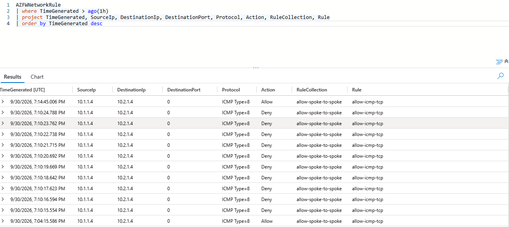

The `AZFWNetworkRule` table returned rows with both `Allow` and `Deny` in the `Action` column. The Deny rows came from the Step 7 test: ten of them, one second apart, one for each blocked echo request. Each allowed ping run appeared as a single row instead, one for the Step 6 test and one for the packet capture run. Every row shows `ICMP Type=8` (echo request) as the protocol. The `Rule` column still reads `allow-icmp-tcp` on the Deny rows, because I changed the rule collection's action rather than the rule itself. The log records which rule matched, and the action column records what the firewall actually enforced. Because I used resource-specific logs, source IP, destination IP, protocol, action, and the matched rule each arrive as their own typed columns, with no message parsing needed.

## Verification Checklist

- [x] `terraform plan` returns "No changes" after apply
- [x] Spoke1 VM has a `10.1.1.x` private IP
- [x] Ping from spoke1 to spoke2 succeeds with the rule collection set to Allow (`ttl=63`)
- [x] Ping fails with the rule collection set to Deny (100% packet loss)
- [x] `terraform plan` returns "No changes" after reverting to Allow
- [x] Packet capture completes and the `.cap` file opens in Wireshark (request TTL 64, reply TTL 63)
- [ ] `NTANetAnalytics` returns rows for the spoke traffic. **Not achieved:** the VNet flow logs never wrote data (see Troubleshooting)
- [x] `AZFWNetworkRule` returns rows showing the Allow and Deny actions

## 🛠️ Troubleshooting

| Issue | Cause | Fix |
|---|---|---|
| VNet flow logs reported `Enabled` / `Succeeded` with Traffic Analytics on, but no `insights-logs-flowlogflowevent` container ever appeared in the storage account, and `NTANetAnalytics` stayed at 0 rows | Unresolved. Not caused by a wrong target, wrong storage account, unregistered `Microsoft.Insights` provider, or lack of traffic (TCP and ICMP both confirmed). The flow logs were created about 76 seconds after Azure auto-created the Network Watcher, but recreating them didn't help either | Recreated both flow logs with `terraform apply` using `-replace` and generated fresh traffic. The container still didn't appear, so I documented the result and tore the lab down rather than keep the firewall running |
| `terraform destroy` failed removing the spoke1 route table association with `409 AnotherOperationInProgress` | Terraform deletes in parallel, and Azure allows one operation at a time on a subnet, so another in-flight delete on the same subnet blocked it | Waited briefly and reran `terraform destroy`. Terraform refreshed state and continued from where it stopped |
| `terraform destroy` failed at the resource group: "the Resource Group still contains Resources", listing an `NWTA-*` data collection endpoint | Traffic Analytics recreated its data collection endpoint after I'd deleted the original, because the flow logs still existed at that point in the teardown | Kept `prevent_deletion_if_contains_resources` on, deleted the recreated endpoint, confirmed the resource group was otherwise empty, and reran `terraform destroy` |
| `az network watcher packet-capture show-status` failed with `unrecognized arguments: --resource-group` | Packet captures are child resources of the regional Network Watcher (in `NetworkWatcherRG`), not of the project's resource group, so the command doesn't take `--resource-group` | Dropped `--resource-group` and passed only `--location centralus --name capture-lab` |

## 🧹 Cleanup

Azure Firewall bills for every hour it's deployed, so I tore everything down as soon as I finished testing. Three things in this lab live outside Terraform's state, and each one needed handling.

**1. The packet capture.** It lives under the Network Watcher in `NetworkWatcherRG`, not in the project's resource group, so it has to be deleted separately:

```powershell
az network watcher packet-capture delete --location centralus --name capture-lab
```

**2. The Traffic Analytics resources.** Even though Traffic Analytics never processed any data, it had created one `NWTA-*` data collection rule and one data collection endpoint in the resource group. Terraform doesn't track them, and the azurerm provider refuses to delete a resource group that still contains untracked resources. The `az monitor data-collection` commands require the `monitor-control-service` CLI extension, which the CLI offered to install on first use. I deleted the rule before the endpoint:

```powershell
$dcr = az monitor data-collection rule list -g rg-lab-network-gavinbarbee --query "[0].name" -o tsv
```

```powershell
az monitor data-collection rule delete --name $dcr --resource-group rg-lab-network-gavinbarbee --yes
```

```powershell
$dce = az monitor data-collection endpoint list -g rg-lab-network-gavinbarbee --query "[0].name" -o tsv
```

```powershell
az monitor data-collection endpoint delete --name $dce --resource-group rg-lab-network-gavinbarbee --yes
```

**3. Destroy.** From the `terraform/` folder:

```powershell
terraform destroy
```

The destroy took three passes:

- **First pass:** hit a `409 AnotherOperationInProgress` on the spoke1 route table association, because Azure was still processing another delete on the same subnet. Rerunning after a short wait cleared it.
- **Second pass:** failed at the resource group. Traffic Analytics had created a **new** data collection endpoint after I deleted the first one, while the flow logs still existed. The provider's safety check caught it. I deleted the new endpoint (there was no new rule) and confirmed the group held nothing else:

```powershell
az resource list -g rg-lab-network-gavinbarbee --query "[].name" -o table
```

- **Third pass:** completed.

Then I confirmed the resource group was gone:

```powershell
az group list --query "[?contains(name, 'lab-network')].name" -o table
```

📸 *Screenshot: final destroy pass and empty resource group check*
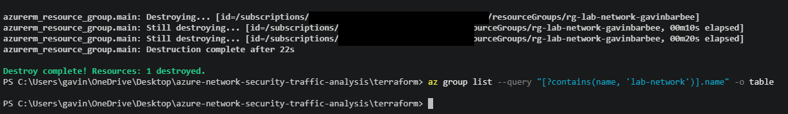

`NetworkWatcher_centralus` remains in `NetworkWatcherRG` after teardown. That's expected, since it's platform-owned, the same as the Network Watchers Azure had already created in my other regions.

## 💡 Key Takeaways

- **Azure's current requirements shaped the design.** Azure Firewall Basic requires a management subnet, a second public IP, and a Firewall Policy instead of classic rules, and NSG flow logs can no longer be created at all. Checking what Azure accepts today before writing code saved several failed applies.
- **TTL made the routing visible.** Every reply came back at `ttl=63`, one hop below Linux's default of 64. That's evidence the UDRs were sending spoke-to-spoke traffic through the firewall, not around it. The packet capture confirmed it from spoke1's side: requests left at TTL 64, and replies came back at TTL 63. Switching the rule collection to Deny dropped 100% of packets, and the firewall's `AZFWNetworkRule` log recorded both the Allow and Deny decisions.
- **"Configured" isn't the same as "working."** Both VNet flow logs reported `Enabled` and `Succeeded` with Traffic Analytics on, yet they never wrote a single blob. I traced the pipeline stage by stage (configuration, raw blobs in storage, Traffic Analytics, workspace table) to find where it stopped. Recreating the flow logs didn't fix it, and I tore down without a root cause rather than keep paying for the firewall.
- **Azure creates things Terraform doesn't know about.** The Network Watcher, the packet capture, and Traffic Analytics' data collection rule and endpoint all live outside state. Traffic Analytics even recreated its endpoint mid-teardown. The provider's `prevent_deletion_if_contains_resources` check caught it, and the right fix was to clean up the leftover, not disable the check.
- **Resource-specific logs are easier to use.** Sending firewall logs to `AZFWNetworkRule` gave typed columns (source, destination, protocol, action, matched rule), with no parsing of free-text messages.
- **Lab access vs. production access.** Run Command let me test private-IP VMs with no inbound path at all. In production I'd use Azure Bastion for interactive SSH, on a paid SKU if it has to reach VMs across peered spokes.

**Business value:** Central inspection in a hub gives one place to enforce and audit which traffic crosses between environments. The firewall's logged Allow/Deny decisions are the kind of evidence security reviews and incident response depend on. The flow log result is just as important in a real environment: monitoring that reports healthy but silently produces nothing is a gap you only find by checking the actual data.

---

**Author:** Gavin Barbee | **Project:** Azure Network Security & Traffic Analysis | **Difficulty:** Intermediate | **Time to Complete:** ~2.5 hours